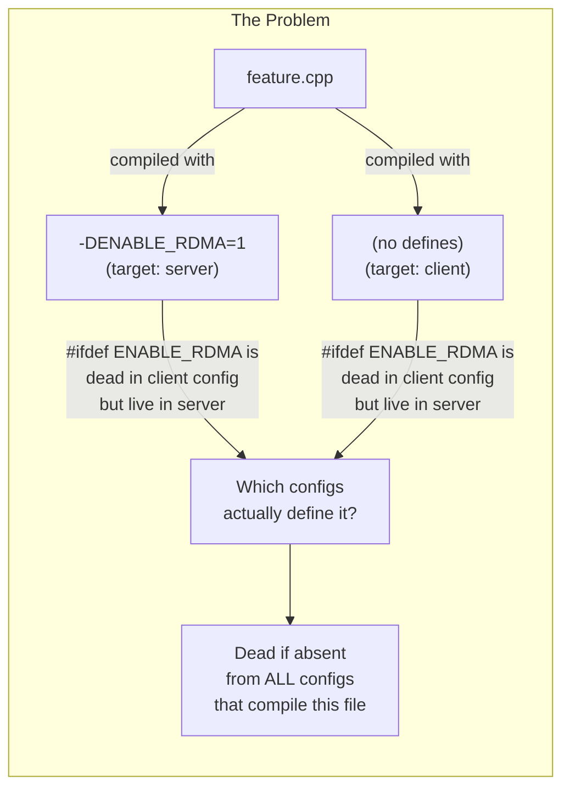
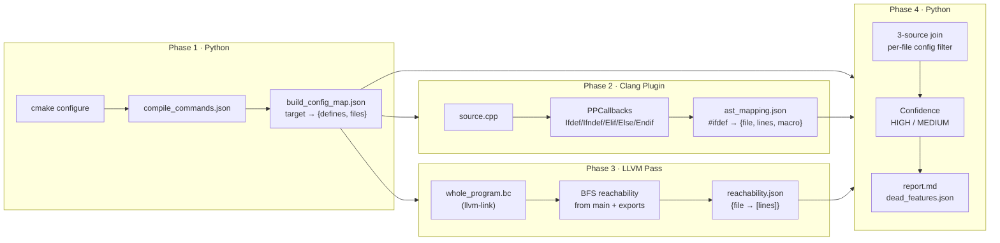
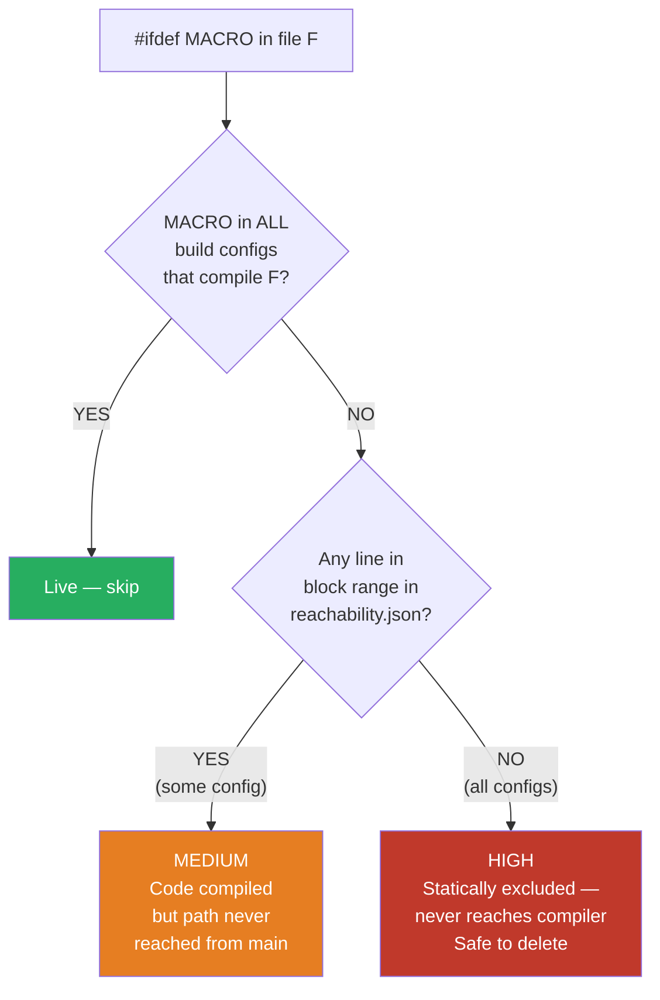

# DESIGN — Dead Feature Detector

## Problem Statement

Large C/C++ codebases accumulate `#ifdef`-guarded blocks over time — feature flags, platform guards, experimental code paths. When a feature is abandoned or a platform dropped, the corresponding `#ifdef` blocks become permanently dead but remain in the codebase, increasing cognitive load and maintenance burden.

The core challenge: a single source file can be compiled under many different `-D` configurations depending on the CMake target. A macro that is dead in *every* configuration is a safe deletion candidate; a macro that is simply *not* defined in one config might still be live in another.

**Goal:** Identify `#ifdef`-guarded code regions that are dead across *all* actual build configurations, with measurable confidence, using whole-program analysis.



---

## Our Approach: Four-Phase Hybrid Pipeline



The pipeline is hybrid because neither the source AST nor the IR alone is sufficient:

- **LLVM IR has no `#ifdef`s.** Preprocessor conditionals are resolved before IR generation. So IR-only analysis cannot tell you which `#ifdef` block a dead basic block came from.
- **AST-level macro tracking has no call graph.** You can see that `#ifdef RDMA` guards a function, but without an IR call graph you cannot determine whether that function is ever called from `main`.

Combining source-level macro locations (Phase 2) with IR-level call-graph reachability (Phase 3) — correlated via debug line numbers — gives both precision and completeness.

---

## Design Rationale

### Why CMake export first (Phase 1)?

A macro absent from a source file's command line does *not* mean it is absent from the project. It might be in a different CMake target, or conditionally applied via an `if(OPTION)` block. Phase 1 reads `compile_commands.json` — the ground truth that CMake writes after configuration — to get the exact set of `-D` flags each TU was compiled with.

### Why PPCallbacks, not a RecursiveASTVisitor?

`#ifdef` / `#endif` are preprocessor directives — they are resolved and discarded before the AST is built. A `RecursiveASTVisitor` would never see them. `PPCallbacks` hooks (`Ifdef`, `Ifndef`, `If`, `Elif`, `Else`, `Endif`) fire as the preprocessor processes directives, giving us exact source locations and macro conditions before any token is emitted to the parser.

### Why LTO (whole-program IR) for Phase 3?

Standard per-TU `-emit-llvm` bitcode contains only the functions defined in that translation unit. Cross-TU calls appear as `declare` stubs with no body. A BFS on per-TU IR would mark almost everything as unreachable (since `main` is in one TU and most functions are in others). `llvm-link` produces whole-program IR where all call edges are present, enabling accurate interprocedural reachability.

### Why per-file config filtering in Phase 4?

A naïve join that looks at all build targets globally would introduce false negatives. Consider: target `client_build` does not define `ENABLE_RDMA` and does not compile `rdma.cpp`. If we include `client_build` in the analysis of `rdma.cpp`, we would incorrectly credit `client_build` as "a config that doesn't define ENABLE_RDMA but does compile rdma.cpp" — when in fact it never compiles that file. Phase 4's `build_file_config_sets()` maps each source file to only the targets that actually compile it, preventing this masking.

### Why two confidence levels?



| Confidence | Meaning | Action |
|------------|---------|--------|
| HIGH | Macro never defined in any build config that compiles this file. Block never reaches the compiler. | Safe to delete |
| MEDIUM | Macro is compiled in at least one config, but IR reachability shows the function is never called. | Review before deleting |

---

## Alternatives Considered

### 1. Naive grep + CMakeLists scan

```bash
grep -rh '#ifdef' src/ | grep -oP '\bENABLE_\w+' | sort -u \
  | xargs -I{} grep -r {} CMakeLists.txt
```

**Limitations:**
- Does not distinguish per-target defines. A macro that appears in `target_compile_definitions(libA PRIVATE FOO=1)` but not `libB` is reported as "defined" even when `libB`'s files use it.
- Cannot identify IR-level dead code (MEDIUM confidence).
- Does not handle `if(OPTION) … target_compile_definitions` patterns — misses macros that are in a disabled CMake option.
- High false-positive rate: reports macros as "defined" wherever they appear in any CMakeLists.txt.

### 2. Phase 1 only (CMake analysis without IR)

Run only the extractor and flag all `#ifdef MACRO` where `MACRO` is absent from every per-file target define set.

**Limitation:** Misses MEDIUM confidence findings — macros that are compiled in some config but whose function bodies are never actually called from any entry point. These are real dead code but require IR analysis to detect.

### 3. clang-tidy `unused-macros` check

`clang-tidy` has a `misc-unused-macros` check, but it only flags macros that are *defined* via `#define` but never used — not macros that are *tested* via `#ifdef` but whose guarded code is always excluded. It operates per-TU and has no cross-TU or build-config awareness.

### 4. cppcheck

`cppcheck --enable=unusedFunction` performs per-TU dead code analysis but does not parse `#ifdef` structure, cannot integrate with CMake build configurations, and has no whole-program call graph.

### 5. Coverity / SonarQube static analysis

Commercial tools offer some dead-code detection but:
- Treat each build configuration independently, not across all configs simultaneously.
- Do not produce `#ifdef`-block-level LoC counts keyed to specific macros.
- Cannot easily be scripted into a lightweight analysis pipeline.
- Require expensive licenses.

### 6. Pure AST macro-expansion tracking (libTooling)

One could write a `RecursiveASTVisitor` that tracks which branches of `#if` / `#ifdef` the compiler actually took. But the AST only represents the branch that *was* taken — the dead branch was discarded by the preprocessor and has no AST nodes. There is no way to recover it from the AST alone.

### 7. LLVM SpeculativeExecution / DCE passes

Standard LLVM dead code elimination passes (DCE, ADCE) operate at the IR level after preprocessing. They can find dead basic blocks within a TU, but:
- They do not correlate dead IR blocks with the source `#ifdef` that produced them (that information is gone).
- They may eliminate dead blocks from within a *live* function, but cannot know whether the entire function is dead because it is never called.
- They do not know which `-D` flags made a block dead.

---

## Key Design Decisions Summary

| Decision | Rationale |
|----------|-----------|
| `PPCallbacks` over `RecursiveASTVisitor` | `#ifdef` is a preprocessor concept; AST never sees dead branches |
| LTO (llvm-link) for Phase 3 | Per-TU IR lacks cross-TU call edges; whole-program IR is required for correct BFS |
| Per-file config filtering in Phase 4 | Prevents false negatives from targets that don't compile the file |
| Fake compiler fallback in Phase 1 | Allows config extraction in CI/cross-compile environments without a full toolchain |
| `HandleTranslationUnit` for JSON flush | PPCallbacks destructor fires too late when hosted in-process; using the ASTConsumer hook ensures reliable output |
| `-add-plugin` not `-plugin` | Plugin type is `CmdlineBeforeMainAction`; `-plugin` requires `ReplaceAction` and would suppress compilation output |
| New Pass Manager (`PassInfoMixin`) | LLVM 17+ deprecated the legacy pass manager; new PM is the supported interface |
| Conservative indirect-call handling | If any reachable function makes an indirect call, all address-taken functions are conservatively added to the reachable set to avoid false positives |
