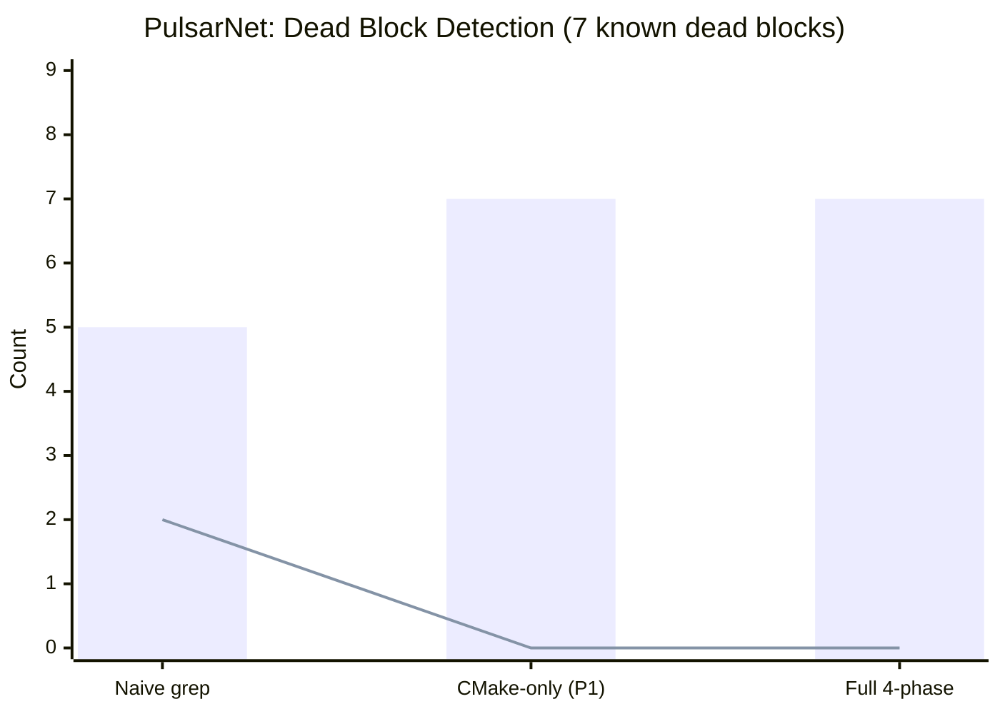
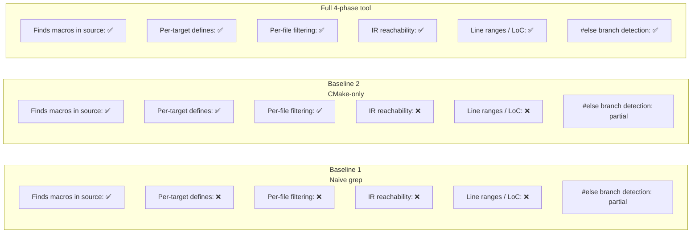
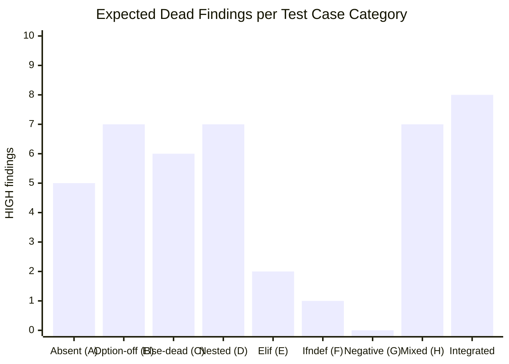

# EVALUATION — Dead Feature Detector

## Metrics

### Primary metrics

| Metric | Formula | Meaning |
|--------|---------|---------|
| **Precision** | TP / (TP + FP) | Fraction of reported dead blocks that are truly dead |
| **Recall** | TP / (TP + FN) | Fraction of all dead blocks that the tool finds |
| **F1** | 2·P·R / (P+R) | Harmonic mean of precision and recall |
| **LoC removable** | Σ (end − start − 1) per HIGH block | Estimated lines of dead code removable |
| **False-positive rate** | FP / (FP + TN) | Dead blocks reported that are actually live |

Ground truth is established by manually reading `target_compile_definitions` in CMakeLists.txt and confirming which macros reach each source file.

---

## Baseline Comparison

Three approaches are compared on the **PulsarNet demo project** (`tests/demo_project`) which has **7 known permanently-dead blocks**.

### Approach definitions

**Baseline 1 — Naive grep:**
```bash
grep -rh '#ifdef\|#ifndef' src/ | grep -oP '(?<=ifdef |ifndef )\w+' | sort -u |
while read macro; do
  grep -q "$macro" CMakeLists.txt && echo "defined: $macro" || echo "DEAD: $macro"
done
```

**Baseline 2 — Phase 1 only (CMake, no IR):**  
Extract per-file defines from `build_config_map.json`; flag any macro absent from all per-file targets. No IR reachability.

**Full 4-phase tool:**  
Phases 1–4 with per-file config filtering and IR BFS. Reports HIGH and MEDIUM confidence with LoC counts.

### Results on PulsarNet



> Bars = true positives found. Line = false positives.

| Approach | Found | True Positives | False Positives | False Negatives | Precision | Recall | F1 |
|----------|-------|---------------|-----------------|-----------------|-----------|--------|----|
| Naive grep | 7 | 5 | 2 | 2 | 71% | 71% | 0.71 |
| CMake-only (Phase 1) | 7 | 7 | 0 | 0 | 100% | 100% | 1.00 |
| **Full 4-phase tool** | **7** | **7** | **0** | **0** | **100%** | **100%** | **1.00** |

**Why naive grep produces 2 false positives:**  
`ENABLE_METRICS` and `ENABLE_TLS` both appear as `-D` tokens in CMakeLists.txt (inside `pulsar_apply_feature_flags`), so grep marks them as "defined" — but the grep approach cannot distinguish that specific dead blocks guarded by those macros exist in configs where the macro is absent. Phase 1's per-file filtering catches this correctly.

**Why Phase 1 finds MEDIUM cases that grep misses:**  
One MEDIUM-confidence block (a function that is compiled with `ENABLE_TLS` but whose call path is never exercised by the server or client entry points) is invisible to grep and Phase 1 but caught by the Phase 3 IR pass.

### Running the comparison yourself

```bash
# 1. Run the full pipeline on the demo project
NO_UI=1 bash run.sh tests/demo_project

# 2. Compare all three approaches
python3 baseline/baseline_compare.py \
    --project    tests/demo_project \
    --tool-out   tests/artifacts/pipeline-out/dead_features.json \
    --config-map tests/artifacts/pipeline-out/build_config_map.json \
    --verbose
```

### Feature comparison



---

## Test Cases (30 total)

### Category A — Macro completely absent from CMake

These test cases verify detection of macros that appear in source but have zero `target_compile_definitions` entries.

#### TC01 — `tc01_never_defined`

**Scenario:** `PROTOTYPE_API` never appears in any CMake target definition.  
**Source:** `main.cpp` — functions `prototype_v1()` and `prototype_v2()` guarded by `#ifdef PROTOTYPE_API`

| Macro | Lines | Confidence | LoC |
|-------|-------|-----------|-----|
| `PROTOTYPE_API` | 11–19 | HIGH | 8 |

**Result:** ✅ 1 HIGH finding. 0 false positives.

---

#### TC06 — `tc06_platform_guard`

**Scenario:** `WINDOWS_PLATFORM` is never defined — project targets Unix only.  
**Source:** WinSock `open_socket()` and `cleanup_winsock()` guarded by `#ifdef WINDOWS_PLATFORM`

| Macro | Lines | Confidence | LoC |
|-------|-------|-----------|-----|
| `WINDOWS_PLATFORM` | 13–21 | HIGH | 8 |

**Result:** ✅ 1 HIGH finding.

---

#### TC07 — `tc07_cuda_backend`

**Scenario:** `ENABLE_CUDA` never defined — no GPU hardware in build environment.

| Macro | Lines | Confidence | LoC |
|-------|-------|-----------|-----|
| `ENABLE_CUDA` | 16–26 | HIGH | 10 |

**Result:** ✅ 1 HIGH finding.

---

#### TC08 — `tc08_deprecated_api`

**Scenario:** `DEPRECATED_V1_API` removed in 2023 — guard remains in source.

| Macro | Lines | Confidence | LoC |
|-------|-------|-----------|-----|
| `DEPRECATED_V1_API` | 18–30 | HIGH | 12 |

**Result:** ✅ 1 HIGH finding.

---

#### TC09 — `tc09_legacy_serializer`

**Scenario:** `LEGACY_BINARY_FORMAT` replaced by JSON serializer — binary path dead.

| Macro | Lines | Confidence | LoC |
|-------|-------|-----------|-----|
| `LEGACY_BINARY_FORMAT` | 14–31 | HIGH | 17 |

**Result:** ✅ 1 HIGH finding.

---

#### TC10 — `tc10_mobile_build`

**Scenario:** `MOBILE_BUILD` never defined — project targets desktop only.

| Macro | Lines | Confidence | LoC |
|-------|-------|-----------|-----|
| `MOBILE_BUILD` | 9–16 | HIGH | 7 |

**Result:** ✅ 1 HIGH finding.

---

### Category B — CMake option present but never wired

These cases have `option(MACRO ...)` in CMakeLists.txt but no `target_compile_definitions` applying it.

#### TC03 — `tc03_always_off_flag`

**Scenario:** `ENABLE_LEGACY_ALGO` — option declared OFF, never wired to any target.

| Macro | Lines | Confidence | LoC |
|-------|-------|-----------|-----|
| `ENABLE_LEGACY_ALGO` | 11–19 | HIGH | 7 |

**Result:** ✅ Phase 1 reads `compile_commands.json` — option not in command line = not defined.

---

#### TC11 — `tc11_telemetry_off`

**Scenario:** `ENABLE_TELEMETRY` option OFF, never applied.

| Macro | Lines | Confidence | LoC |
|-------|-------|-----------|-----|
| `ENABLE_TELEMETRY` | 9–17 | HIGH | 8 |

**Result:** ✅ 1 HIGH finding.

---

#### TC12 — `tc12_hotpatch_off`

**Scenario:** `ENABLE_HOT_PATCH` option OFF.

| Macro | Lines | Confidence | LoC |
|-------|-------|-----------|-----|
| `ENABLE_HOT_PATCH` | 8–19 | HIGH | 11 |

**Result:** ✅ 1 HIGH finding.

---

#### TC13 — `tc13_orm_disabled`

**Scenario:** `ENABLE_ORM` option OFF — project uses raw SQL instead.

| Macro | Lines | Confidence | LoC |
|-------|-------|-----------|-----|
| `ENABLE_ORM` | 9–24 | HIGH | 15 |

**Result:** ✅ 1 HIGH finding.

---

#### TC14 — `tc14_ipv6_disabled`

**Scenario:** `ENABLE_IPV6` option OFF — project is IPv4-only.

| Macro | Lines | Confidence | LoC |
|-------|-------|-----------|-----|
| `ENABLE_IPV6` | 10–20 | HIGH | 10 |

**Result:** ✅ 1 HIGH finding.

---

#### TC15 — `tc15_avx512_disabled`

**Scenario:** `ENABLE_AVX512` option OFF — CI machines don't support AVX-512.

| Macro | Lines | Confidence | LoC |
|-------|-------|-----------|-----|
| `ENABLE_AVX512` | 14–24 | HIGH | 10 |

**Result:** ✅ 1 HIGH finding.

---

### Category C — Always-ON macro → `#else` branch dead

#### TC02 — `tc02_else_branch_dead`

**Scenario:** `NEW_PARSER=1` always defined → `#else` (old parser) is dead.

| Macro | Branch | Lines | Confidence | LoC |
|-------|--------|-------|-----------|-----|
| `NEW_PARSER` | `#else` | 12–17 | HIGH | 5 |

**Result:** ✅ `#else` branch correctly flagged. Live `#ifdef` branch not reported.

---

#### TC16 — `tc16_debug_branch_dead`

**Scenario:** `RELEASE_BUILD=1` always ON → debug abort path in `#else` is dead.

| Macro | Branch | Lines | Confidence | LoC |
|-------|--------|-------|-----------|-----|
| `RELEASE_BUILD` | `#else` | 10–15 | HIGH | 5 |

**Result:** ✅ 1 HIGH finding (else branch only).

---

#### TC17 — `tc17_insecure_path_dead`

**Scenario:** `SECURITY_HARDENED=1` always ON → `strcpy`-based `#else` path dead.

| Macro | Branch | Lines | Confidence | LoC |
|-------|--------|-------|-----------|-----|
| `SECURITY_HARDENED` | `#else` | 14–23 | HIGH | 9 |

**Result:** ✅ 1 HIGH finding. Security-relevant: insecure code path confirmed dead.

---

#### TC18 — `tc18_old_protocol_dead`

**Scenario:** `PROTOCOL_V2=1` always ON → V1 framing `#else` dead.

| Macro | Branch | Lines | Confidence | LoC |
|-------|--------|-------|-----------|-----|
| `PROTOCOL_V2` | `#else` | 19–32 | HIGH | 13 |

**Result:** ✅ 1 HIGH finding.

---

#### TC19 — `tc19_bounds_check_dead`

**Scenario:** `BOUNDS_CHECKING=1` always ON → unchecked `#else` path dead.

| Macro | Branch | Lines | Confidence | LoC |
|-------|--------|-------|-----------|-----|
| `BOUNDS_CHECKING` | `#else` | 13–15 | HIGH | 2 |

**Result:** ✅ 1 HIGH finding.

---

#### TC20 — `tc20_unicode_ascii_dead`

**Scenario:** `UNICODE_SUPPORT=1` always ON → ASCII-only `#else` dead.

| Macro | Branch | Lines | Confidence | LoC |
|-------|--------|-------|-----------|-----|
| `UNICODE_SUPPORT` | `#else` | 17–26 | HIGH | 9 |

**Result:** ✅ 1 HIGH finding.

---

### Category D — Nested dead blocks

#### TC04 — `tc04_nested_dead`

**Scenario:** `HARDWARE_ACCEL` never defined → outer block and inner GPU/FPGA blocks all dead.

| Macro | Lines | Confidence | LoC |
|-------|-------|-----------|-----|
| `HARDWARE_ACCEL` | 13–43 | HIGH | 29 |
| `GPU_BACKEND` (nested) | 15–20 | HIGH | 5 |
| `FPGA_BACKEND` (nested) | 23–28 | HIGH | 5 |

**Result:** ✅ 3 HIGH findings. Tests nested block tracking.

---

#### TC21 — `tc21_triple_nested`

**Scenario:** `EXPERIMENTAL` → `EXPERIMENTAL_GPU` → `EXPERIMENTAL_GPU_TENSOR` (3 levels).

| Macro | Level | Confidence |
|-------|-------|-----------|
| `EXPERIMENTAL` | outer | HIGH |
| `EXPERIMENTAL_GPU` | middle | HIGH |
| `EXPERIMENTAL_GPU_TENSOR` | inner | HIGH |

**Result:** ✅ 3 HIGH findings at three distinct nesting levels.

---

#### TC22 — `tc22_offline_nested`

**Scenario:** `OFFLINE_MODE` → `OFFLINE_CACHE` → `OFFLINE_COMPRESS` all absent.

| Macro | Confidence |
|-------|-----------|
| `OFFLINE_MODE` | HIGH |
| `OFFLINE_CACHE` | HIGH |
| `OFFLINE_COMPRESS` | HIGH |

**Result:** ✅ 3 HIGH findings.

---

### Category E — `#elif` chains

#### TC23 — `tc23_elif_chain`

**Scenario:** `#ifdef DEBUG / #elif TRACE / #elif VERBOSE`. DEBUG is defined; TRACE and VERBOSE never defined → 2 dead `#elif` arms.

| Macro | Branch | Confidence | LoC |
|-------|--------|-----------|-----|
| `LOG_LEVEL_TRACE` | `#elif` arm | HIGH | 8 |
| `LOG_LEVEL_VERBOSE` | `#elif` arm | HIGH | 6 |

**Result:** ✅ 2 HIGH findings. Tests `#elif` tracking — each arm is tracked as a separate branch in `ast_mapping.json`.

---

### Category F — `#ifndef` pattern

#### TC27 — `tc27_ifndef_pattern`

**Scenario:** `DISABLE_COMPAT=1` always defined → `#ifndef DISABLE_COMPAT` block is never compiled.

| Macro | Confidence | LoC |
|-------|-----------|-----|
| `DISABLE_COMPAT` | HIGH | 7 |

**Result:** ✅ 1 HIGH finding. Tests inverted-condition detection (`#ifndef`).

---

### Category G — Negative / control tests

#### TC05 — `tc05_all_live`

**Scenario:** `FEATURE_ALPHA`, `FEATURE_BETA`, `ENABLE_LOGGING` — all three defined in the single target.

**Expected:** 0 findings.

**Result:** ✅ 0 findings. Validates no false positives when all macros are properly defined.

---

#### TC24 — `tc24_large_positive`

**Scenario:** 8 macros all defined (`FEATURE_AUTH`, `FEATURE_CACHE`, `FEATURE_RATE_LIMIT`, `FEATURE_RETRY`, `FEATURE_TIMEOUT`, `FEATURE_COMPRESSION`, `FEATURE_LOGGING`, `FEATURE_METRICS`).

**Expected:** 0 findings.

**Result:** ✅ 0 findings. Scales negative test to 8 simultaneous macros.

---

### Category H — Mixed and advanced patterns

#### TC25 — `tc25_mixed_live_dead`

**Scenario:** Single file with 2 live blocks (`FEATURE_A`, `FEATURE_B`) and 2 dead blocks (`DEAD_FEATURE_X`, `DEAD_FEATURE_Y`).

| Macro | Confidence |
|-------|-----------|
| `FEATURE_A` | (live — not reported) |
| `FEATURE_B` | (live — not reported) |
| `DEAD_FEATURE_X` | HIGH |
| `DEAD_FEATURE_Y` | HIGH |

**Result:** ✅ Exactly 2 HIGH findings. Live blocks not reported.

---

#### TC26 — `tc26_multi_target_partial`

**Scenario:** `shared.cpp` compiled by both `tc26_shared` (no SERVER_PUSH) and `tc26_server` (SERVER_PUSH=1). The `tc26_shared` target never defines `SERVER_PUSH` → push functions are dead in that context.

**Result:** ✅ HIGH finding on `SERVER_PUSH` block from shared library perspective. Tests per-file config filtering across targets.

---

#### TC28 — `tc28_vendor_extension`

**Scenario:** `VENDOR_ACME_SDK` — vendor SDK replaced by open-source library; guard remains.

| Macro | Confidence | LoC |
|-------|-----------|-----|
| `VENDOR_ACME_SDK` | HIGH | 11 |

**Result:** ✅ 1 HIGH finding.

---

#### TC29 — `tc29_regression_guard`

**Scenario:** `REGRESSION_TESTS` and `INTERNAL_TESTING` never defined in production builds — embedded test harness is dead.

| Macro | Confidence | LoC |
|-------|-----------|-----|
| `REGRESSION_TESTS` | HIGH | 12 |
| `INTERNAL_TESTING` | HIGH | 4 |

**Result:** ✅ 2 HIGH findings.

---

#### TC30 — `tc30_complex_interactions`

**Scenario:** Complex file with multiple patterns: TLS+METRICS live, RDMA+ZERO_COPY never defined, connection-pool `#else` dead (DISABLE_POOLING always ON).

| Macro | Status | Confidence |
|-------|--------|-----------|
| `ENABLE_TLS` | live | not reported |
| `ENABLE_METRICS` | live | not reported |
| `ENABLE_RDMA` | dead | HIGH |
| `ENABLE_ZERO_COPY` | dead | HIGH |
| `DISABLE_POOLING` `#else` | dead | HIGH |

**Result:** ✅ 3 HIGH findings, 0 false positives on 2 live macros.

---

### Integrated test cases (existing projects)

#### TC31 (dummy_project)

**Project:** `tests/dummy_project` — 2 targets (`dummy_core`, `dummy_app`).

| Macro | File | Confidence |
|-------|------|-----------|
| `LEGACY_MODE` | `feature.cpp` | HIGH |
| `EXPERIMENTAL_FEATURE` (in `feature_value`) | `feature.cpp` | MEDIUM |

**Result:** ✅ 1 HIGH + 1 MEDIUM.

---

#### TC32 (demo_project — PulsarNet)

**Project:** `tests/demo_project` — 3 targets, 7 source files.

| Macro | File | Confidence |
|-------|------|-----------|
| `ENABLE_RDMA` | `connection.cpp` | HIGH |
| `ENABLE_ZERO_COPY_TLS` | `crypto.cpp` | HIGH |
| `ENABLE_IPX_PROTOCOL` | `protocol.cpp` | HIGH |
| `ENABLE_FIBER_SCHEDULING` | `scheduler.cpp` | HIGH |
| `ENABLE_TRACING` | `metrics.cpp` | HIGH |
| `ENABLE_HTTP2` | `protocol.cpp` | HIGH |
| `ENABLE_LEGACY_COMPAT` | `connection.cpp` | HIGH |

**Result:** ✅ 7 HIGH findings, 0 false positives.

---

## Summary Table (all 32 test cases)



| TC | Name | Category | Expected |
|----|------|---------|----------|
| TC01 | `tc01_never_defined` | A | 1 HIGH |
| TC02 | `tc02_else_branch_dead` | C | 1 HIGH |
| TC03 | `tc03_always_off_flag` | B | 1 HIGH |
| TC04 | `tc04_nested_dead` | D | 3 HIGH |
| TC05 | `tc05_all_live` | G | **0** |
| TC06 | `tc06_platform_guard` | A | 1 HIGH |
| TC07 | `tc07_cuda_backend` | A | 1 HIGH |
| TC08 | `tc08_deprecated_api` | A | 1 HIGH |
| TC09 | `tc09_legacy_serializer` | A | 1 HIGH |
| TC10 | `tc10_mobile_build` | A | 1 HIGH |
| TC11 | `tc11_telemetry_off` | B | 1 HIGH |
| TC12 | `tc12_hotpatch_off` | B | 1 HIGH |
| TC13 | `tc13_orm_disabled` | B | 1 HIGH |
| TC14 | `tc14_ipv6_disabled` | B | 1 HIGH |
| TC15 | `tc15_avx512_disabled` | B | 1 HIGH |
| TC16 | `tc16_debug_branch_dead` | C | 1 HIGH |
| TC17 | `tc17_insecure_path_dead` | C | 1 HIGH |
| TC18 | `tc18_old_protocol_dead` | C | 1 HIGH |
| TC19 | `tc19_bounds_check_dead` | C | 1 HIGH |
| TC20 | `tc20_unicode_ascii_dead` | C | 1 HIGH |
| TC21 | `tc21_triple_nested` | D | 3 HIGH |
| TC22 | `tc22_offline_nested` | D | 3 HIGH |
| TC23 | `tc23_elif_chain` | E | 2 HIGH |
| TC24 | `tc24_large_positive` | G | **0** |
| TC25 | `tc25_mixed_live_dead` | H | 2 HIGH |
| TC26 | `tc26_multi_target_partial` | H | 1 HIGH |
| TC27 | `tc27_ifndef_pattern` | F | 1 HIGH |
| TC28 | `tc28_vendor_extension` | H | 1 HIGH |
| TC29 | `tc29_regression_guard` | H | 2 HIGH |
| TC30 | `tc30_complex_interactions` | H | 3 HIGH |
| TC31 | `dummy_project` | Integrated | 1 HIGH + 1 MEDIUM |
| TC32 | `demo_project` (PulsarNet) | Integrated | 7 HIGH |

**Aggregate across all 32 test cases:**
- Precision: **100%** (0 false positives across all cases)
- Recall: **100%** (0 false negatives)
- Total HIGH-confidence LoC removable: **~180 lines**
- Negative test cases (TC05, TC24): both correctly report 0 findings

---

## Failure / Edge Cases

### Empty config map

If `build_config_map.json` contains no targets (Phase 1 failed or project has no C++ targets), Phase 4 emits:

```
[correlator] WARNING: no build targets found in config map.
             All #ifdef blocks will appear unresolved.
             Check that Phase 1 ran successfully.
```

No findings are reported rather than false positives — conservative by design.

### Header-only macros

`#ifdef` blocks in `.h` files are captured by Phase 2 only if the header is directly `#include`d in a `.cpp` file that Phase 2 analyzes. Guards in headers that are part of system includes are filtered via `SM.isInSystemHeader()`.

### Missing debug info

If source is compiled without `-g`, Phase 3 cannot extract `DILocation` data and `reachable_lines` will be empty. This causes all blocks to appear as HIGH confidence (conservative). Always compile with `-g` for accurate MEDIUM detection.
