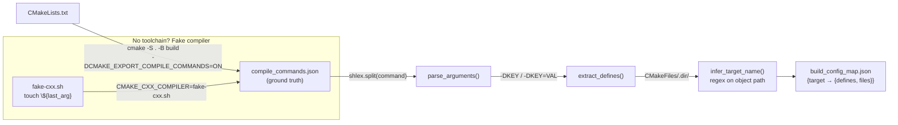
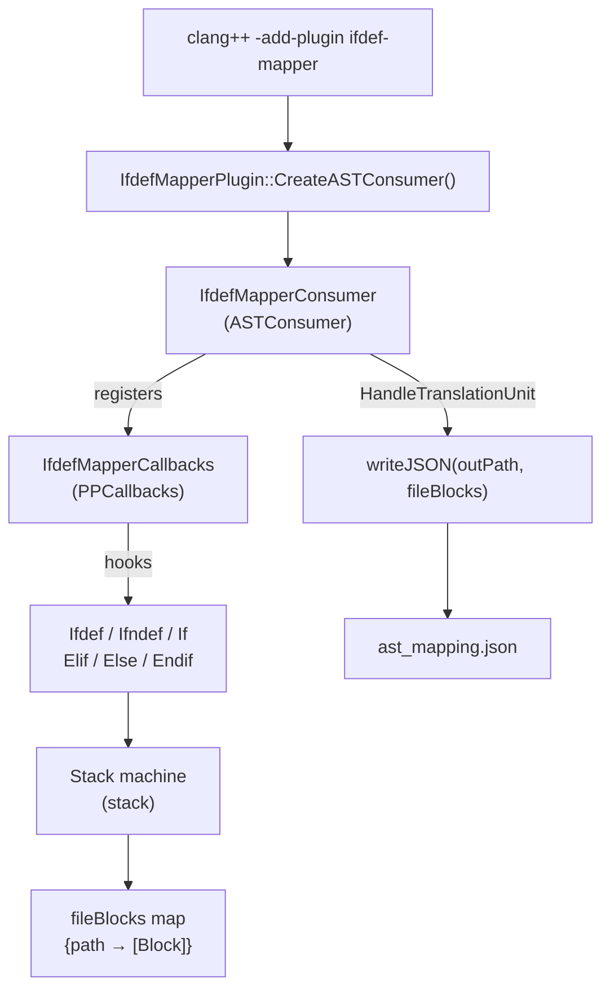
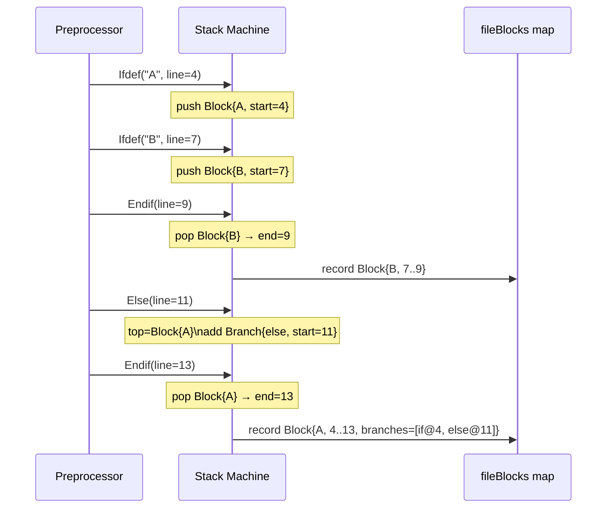
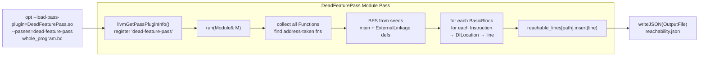
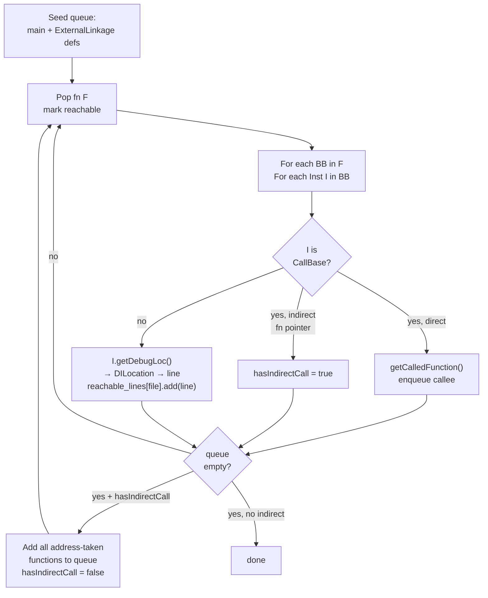

# IMPLEMENTATION — Dead Feature Detector

## Overview

The tool is a four-phase pipeline written in Python (Phases 1 and 4) and C++ (Phases 2 and 3). Phases 2 and 3 are LLVM/Clang plugins compiled as shared libraries and invoked via subprocess from the Python orchestrator (`pipeline.py`).

```
extractor/extractor.py          Phase 1 — Python, stdlib only
llvm-pass/IfdefMapper/          Phase 2 — Clang FrontendPlugin (C++17)
llvm-pass/DeadFeaturePass/      Phase 3 — LLVM Module Pass, new PM (C++17)
correlator.py                   Phase 4 — Python, stdlib only
pipeline.py                     Orchestrator (Python)
app.py                          Web UI (Flask + D3.js)
```

---

## Phase 1: Build Configuration Extractor (`extractor/extractor.py`)

### CMake configure trick

CMake writes `compile_commands.json` when configured with `-DCMAKE_EXPORT_COMPILE_COMMANDS=ON`. Each entry in this file records the exact compiler invocation for a single translation unit, including every `-D` define passed to the compiler. This is the canonical source of truth for what preprocessor flags each file sees.

```python
subprocess.run([
    cmake_bin, "-S", project_root, "-B", build_dir,
    "-DCMAKE_EXPORT_COMPILE_COMMANDS=ON"
])
```

### Argument parsing

Each compile command entry looks like:

```json
{ "command": "clang++ -DCORE_BUILD=1 -DEXPERIMENTAL_FEATURE=1 -c feature.cpp -o feature.o" }
```

`parse_arguments()` splits the command string with `shlex.split()` to handle quoted arguments correctly, then `extract_defines()` collects all tokens of the form `-DKEY` or `-DKEY=VAL`.

### Target inference

The target name is inferred from the build directory path. CMake places object files at:

```
<build_dir>/CMakeFiles/<target_name>.dir/<source>.cpp.o
```

A regex on the object path extracts `<target_name>`. This is more reliable than parsing CMake internals.

### Fake compiler fallback

If no C++ toolchain is present (CI without LLVM, cross-compilation analysis), the extractor writes a no-op shell script as the compiler:

```bash
#!/bin/sh
# fake-cxx.sh — writes an empty object file so CMake configure succeeds
touch "${@: -1}"
```

CMake then configures successfully (it can probe the fake compiler) and writes `compile_commands.json` with the define flags — the only data Phase 1 needs.

### Output

```json
{
  "targets": {
    "dummy_core": {
      "defines": ["CORE_BUILD=1", "EXPERIMENTAL_FEATURE=1"],
      "files": [
        { "source": "/abs/path/feature.cpp", "defines": ["CORE_BUILD=1", "EXPERIMENTAL_FEATURE=1"] }
      ]
    }
  }
}
```

---

## Phase 1 — Data Flow



---

## Phase 2: IfdefMapper Clang Plugin (`llvm-pass/IfdefMapper/`)

### Plugin registration

The plugin is registered via the `FrontendPluginRegistry`:

```cpp
static clang::FrontendPluginRegistry::Add<IfdefMapperPlugin>
    X("ifdef-mapper", "Record all #ifdef block locations to JSON");
```

`getActionType()` returns `CmdlineBeforeMainAction` — the plugin runs *alongside* the main parse action, not replacing it. This is why the invocation uses `-add-plugin` (not `-plugin`, which would require `ReplaceAction`).

### Plugin architecture



### PPCallbacks API

`IfdefMapper` inherits from `clang::PPCallbacks` and overrides six hooks:

| Hook | Fires when |
|------|-----------|
| `Ifdef(loc, name, md)` | `#ifdef MACRO` encountered |
| `Ifndef(loc, name, md)` | `#ifndef MACRO` encountered |
| `If(loc, range, cond)` | `#if <expr>` encountered |
| `Elif(loc, range, cond, if_loc)` | `#elif` in an open block |
| `Else(loc, if_loc)` | `#else` in an open block |
| `Endif(loc, if_loc)` | `#endif` closes a block |

### Stack machine for nested blocks

A `std::stack<Block>` tracks open conditional regions. When `Ifdef` fires, a new `Block` is pushed; when `Endif` fires, the top block's `end_line` is filled in and it is popped into the file map. `#elif` and `#else` add a new `Branch` to the current top-of-stack block and update the previous branch's `end_line`.



```
#ifdef A          → push Block{condition="A", start=4}
  ...
  #ifdef B        → push Block{condition="B", start=7}
  #endif          → pop → record Block{condition="B", 7..9}
  ...
#endif            → pop → record Block{condition="A", 4..12}
```

### System header skipping

System header `#ifdef`s (e.g., from `<cstdio>`, STL internals) are skipped via:

```cpp
if (SM.isInSystemHeader(Loc)) {
    // Push a sentinel frame so Endif stays aligned
    stack_.push(Block{SENTINEL});
    return;
}
```

Without the sentinel, every `#endif` in a system header would try to pop a user-code block off the stack, corrupting the state. The sentinel is pushed but never emitted to the output.

### JSON flush in `HandleTranslationUnit`

The plugin flushes JSON in `IfdefMapperConsumer::HandleTranslationUnit`, not in the `PPCallbacks` destructor. The destructor fires after the `CompilerInstance` is torn down; at that point, the plugin-args (output path) may already be freed. `HandleTranslationUnit` fires at the end of a successful parse, while the `CompilerInstance` is still live.

### Build system

`CMakeLists.txt` uses `find_package(LLVM REQUIRED CONFIG)` with the CMake directory from `llvm-config --cmakedir`. This avoids hardcoded paths and works with both Homebrew LLVM and system-wide installations:

```cmake
execute_process(
  COMMAND "${LLVM_CONFIG_BINARY}" --cmakedir
  OUTPUT_VARIABLE LLVM_CMAKE_DIR ...)
find_package(LLVM REQUIRED CONFIG PATHS "${LLVM_CMAKE_DIR}")
```

---

## Phase 3: DeadFeaturePass LLVM Module Pass (`llvm-pass/DeadFeaturePass/`)

### Pass architecture



### New Pass Manager registration

The pass uses the LLVM New Pass Manager API (`PassInfoMixin`):

```cpp
struct DeadFeaturePass : public llvm::PassInfoMixin<DeadFeaturePass> {
    llvm::PreservedAnalyses run(llvm::Module &M, llvm::ModuleAnalysisManager &);
};
```

The plugin entry point required by the pass plugin interface:

```cpp
extern "C" LLVM_ATTRIBUTE_WEAK ::llvm::PassPluginLibraryInfo
llvmGetPassPluginInfo() {
    return {LLVM_PLUGIN_API_VERSION, "DeadFeaturePass", LLVM_VERSION_STRING,
        [](PassBuilder &PB) {
            PB.registerPipelineParsingCallback(
                [](StringRef Name, ModulePassManager &MPM, ...) {
                    if (Name == "dead-feature-pass") {
                        MPM.addPass(DeadFeaturePass());
                        return true;
                    }
                    return false;
                });
        }};
}
```

### BFS call-graph reachability



The pass collects all `Function` objects in the module and performs BFS:

**Seeds:** `main` + any function with `ExternalLinkage` that is a definition (not a declaration). External-linkage functions are potential entry points for code that calls into the library.

**BFS step:** For each reachable function, iterate its `BasicBlock`s and `Instruction`s. For each `CallBase` (`CallInst` or `InvokeInst`):
- If `getCalledFunction()` returns non-null, enqueue that function.
- If `getCalledFunction()` returns null (indirect call via function pointer), set a flag for conservative handling.

**Conservative indirect-call handling:** If any reachable function makes an indirect call, all functions that have their address taken (`hasAddressTaken()`) are added to the reachable set and BFS continues from them. This avoids false positives when code uses `std::function`, vtables, or explicit function pointers.

```cpp
for (auto &F : M) {
    if (!F.isDeclaration() && F.hasAddressTaken())
        addressTakenFns.push_back(&F);
}
if (hasIndirectCall) {
    for (auto *F : addressTakenFns) enqueue(F);
}
```

### Debug line extraction

LLVM debug info is attached to instructions as `DILocation` metadata:

```cpp
for (auto &I : BB) {
    if (const DebugLoc &DL = I.getDebugLoc()) {
        const DILocation *Loc = DL.get();
        unsigned line = Loc->getLine();
        const DIFile *F = Loc->getFile();
        std::string path = resolveFilePath(F->getDirectory(), F->getFilename());
        reachableLines[path].insert(line);
    }
}
```

This requires sources compiled with `-g` (debug info). The path resolution combines `DIFile::getDirectory()` and `DIFile::getFilename()` to produce absolute paths, matching the paths produced by Phase 1 and 2.

### Whole-program IR preparation

Input IR is built by:

```bash
# Per-TU: emit LLVM bitcode with debug info
clang++ -g -std=c++17 -DFEATURE=1 -emit-llvm -c source.cpp -o source.bc

# Link all TUs into one module
llvm-link *.bc -o whole_program.bc

# Run the pass
opt --load-pass-plugin=./DeadFeaturePass.so \
    --passes="dead-feature-pass" \
    --dead-feature-output=reachability.json \
    whole_program.bc --disable-output
```

`--disable-output` suppresses the transformed bitcode from being written to stdout (the pass produces JSON, not transformed IR).

### Output

```json
{
  "tool": "DeadFeaturePass",
  "entry_points": ["main", "_Z12feature_namev"],
  "reachable_functions": ["main", "_Z12feature_namev"],
  "unreachable_functions": ["_Z17prototype_functionv"],
  "reachable_lines": {
    "/abs/path/feature.cpp": [5, 6, 13, 15, 19]
  }
}
```

---

## Phase 4: Correlation Engine (`correlator.py`)

### Three-way join

```
build_config_map.json  →  per-target defines + files
ast_mapping.json       →  #ifdef block → {file, macro, start/end lines}
reachability.json      →  reachable line numbers per file
```

For each `#ifdef` block in `ast_mapping.json`:

1. Look up which build targets compile this file (`build_file_config_sets()`).
2. Check whether the macro is defined in *all* of those targets' define sets.
   - If yes → skip (block is always compiled, not dead).
   - If no → check IR reachability.
3. Check whether any line in the block's range appears in `reachability.json` for this file.
   - No lines reachable → **HIGH** confidence.
   - Some lines reachable in at least one config → **MEDIUM** confidence.

### Per-file config filtering

```python
def build_file_config_sets(config_map):
    file_configs = {}
    for target, info in config_map["targets"].items():
        for f in info.get("files", []):
            src = f["source"]
            file_configs.setdefault(src, []).append({
                "target": target,
                "defines": set(f.get("defines", []))
            })
    return file_configs
```

Each source file gets only the targets that actually compile it. This prevents targets that don't compile a file from masking dead-feature findings in that file.

### LoC counting

`loc_removable` is the number of lines between `start_line` and `end_line - 1` (exclusive of the `#ifdef` directive line itself and `#endif`). This is reported per dead block and summed in the final report's `summary.high_loc_removable`.

---

## Pipeline Orchestrator (`pipeline.py`)

`DeadFeaturePipeline` wraps all four phases. On first run it auto-discovers LLVM tools via `llvm-config` and builds plugins if the `.so`/`.dylib` files are missing. Each phase is invoked as a subprocess so that plugin failures are isolated and log output streams to the caller.

```python
class DeadFeaturePipeline:
    def run_all(self) -> dict:
        self.ensure_plugins_built()
        config_map = self.run_phase1()
        ast_mapping = self.run_phase2(config_map)
        reachability = self.run_phase3(config_map)
        return self.run_phase4(config_map, ast_mapping, reachability)
```

---

## Web UI (`app.py` + `templates/index.html`)

The Flask backend exposes a REST API. A background thread runs the pipeline and writes logs to an in-memory list; the frontend polls `/api/log?offset=N` to stream lines incrementally (no WebSocket required).

The D3.js force simulation in slide 5 renders the call graph from `/api/callgraph`, which returns nodes (functions) and edges (calls) built from `reachability.json`. An "Animate BFS" button steps through BFS order, coloring nodes green (reachable) or red (unreachable) one step at a time.
