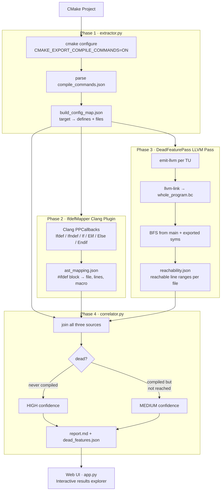
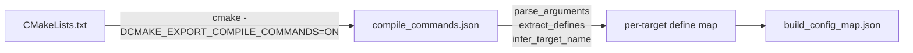
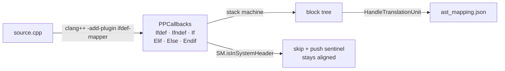
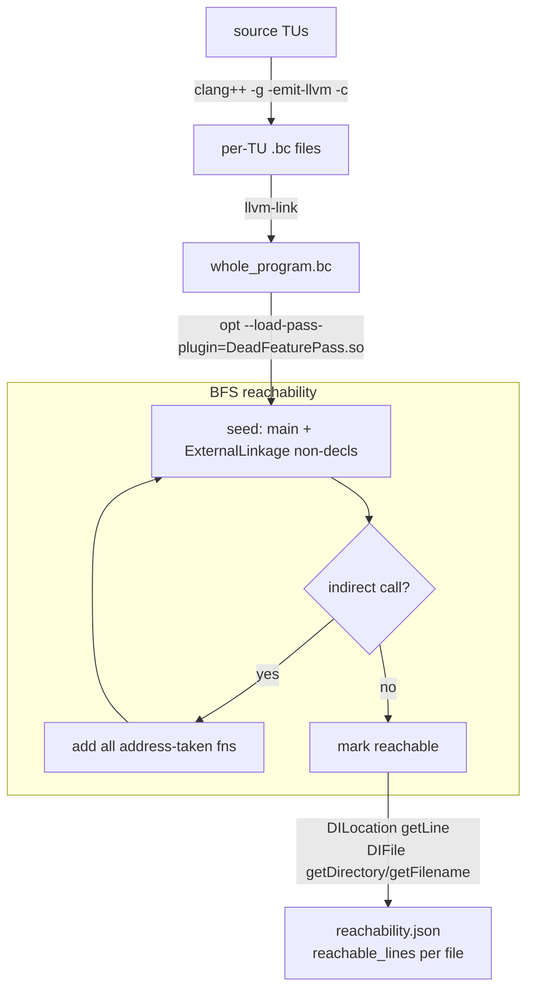
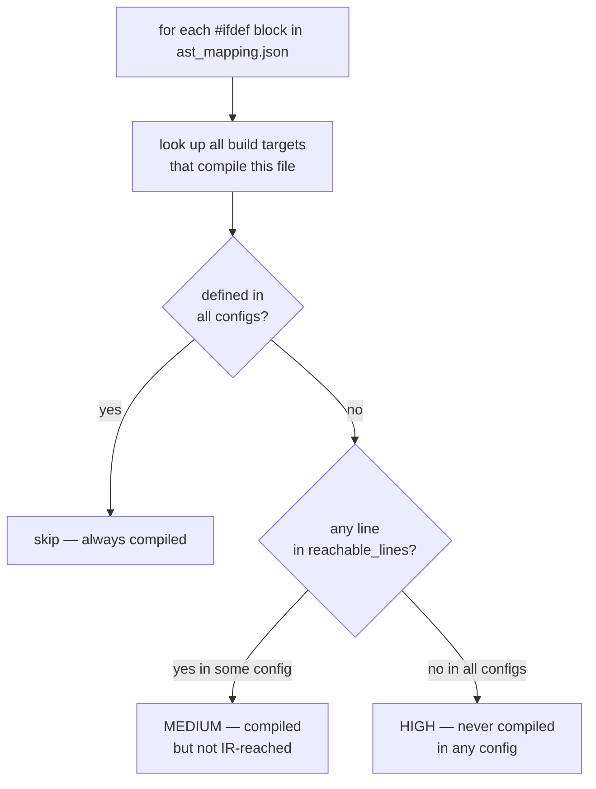
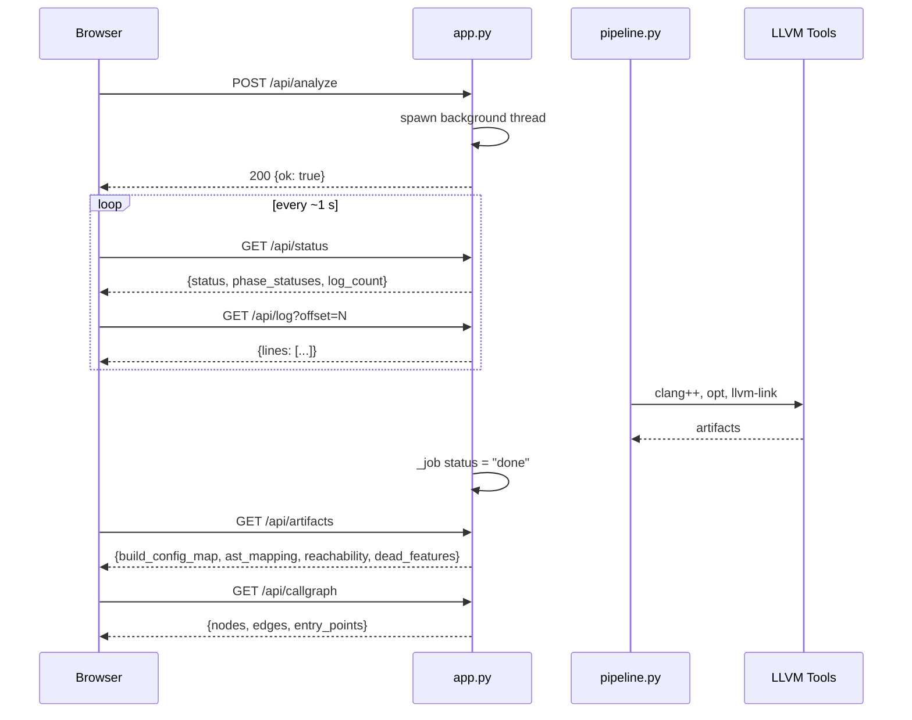

# Assignment 29: Dead Feature Detector

A whole-program LLVM/Clang analysis tool that identifies code regions guarded by preprocessor flags that are **unreachable under any actual build configuration**. Traditional dead-code elimination works per translation unit; this tool combines build-system-level configuration analysis with IR-level reachability to find feature-guarded blocks that are dead **across all real configurations**.

---
## Screen Recording (Demo)

<video src="https://github.com/user-attachments/assets/3996d06f-d5fe-4dfe-b427-41339877e08f" width="100%" autoplay muted loop></video>

---

## Pipeline Overview



---

## Phase Status

| Phase | Component | Status |
|-------|-----------|--------|
| 1 | CMake define extractor (`extractor/extractor.py`) | ✅ Complete |
| 2 | Clang preprocessor plugin (`llvm-pass/IfdefMapper`) | ✅ Complete |
| 3 | LLVM whole-program reachability pass (`llvm-pass/DeadFeaturePass`) | ✅ Complete |
| 4 | Correlation engine & Markdown reporter (`correlator.py`) | ✅ Complete |
| 5 | Evaluation on `zlib` / `sqlite` | 🔲 Planned |

---

## Quickstart

```bash
# Run the full pipeline + open the interactive web UI (default: demo project)
bash run.sh

# Custom project
bash run.sh /path/to/cmake/project

# Custom project + output dir + port
bash run.sh /path/to/cmake/project /tmp/dfd-out 8080

# Pipeline only (no browser)
NO_UI=1 bash run.sh /path/to/cmake/project

# Custom llvm-config
LLVM_CONFIG=/opt/homebrew/opt/llvm/bin/llvm-config bash run.sh
```

`run.sh` installs Flask if needed, runs `pipeline.py` headlessly, then launches `app.py` pre-loaded with the results.

---

## Phase 1: Build Configuration Extractor

### What it does

`extractor/extractor.py` takes a CMake project, forces a CMake configure with
`-DCMAKE_EXPORT_COMPILE_COMMANDS=ON`, parses `compile_commands.json`, and emits
a JSON file mapping each CMake target to the exact `-D` preprocessor flags used
to compile it.

Falls back to a **fake no-op compiler** (`fake-cxx.sh` / `fake-cxx.cmd`) written
into the build directory when no real C++ toolchain is present, allowing
metadata-only extraction without a full toolchain.

### Internal flow



### Usage

```bash
python3 extractor/extractor.py \
  --project <path/to/cmake/project> \
  --output  <path/to/output.json> \
  [--build-dir <build-dir>]      # default: <project>/build-extractor
  [--cmake-bin <cmake-path>]     # default: cmake on PATH
  [--verbose]
```

### Tests

```bash
bash tests/run_phase1_test.sh                                     # macOS / Linux
powershell -ExecutionPolicy Bypass -File .\tests\run_phase1_test.ps1  # Windows
```

### Output format (`build_config_map.json`)

```json
{
  "generated_at": "<ISO-8601 UTC>",
  "project_root": "/abs/path/to/project",
  "build_dir":    "/abs/path/to/build",
  "targets": {
    "dummy_core": {
      "defines": ["CORE_BUILD=1", "EXPERIMENTAL_FEATURE=1"],
      "files": [
        { "source": "/abs/path/feature.cpp", "defines": ["CORE_BUILD=1", "EXPERIMENTAL_FEATURE=1"] }
      ]
    }
  }
}
```

---

## Phase 2: Clang Preprocessor Plugin (IfdefMapper)

`llvm-pass/IfdefMapper/` — a Clang plugin using `PPCallbacks` to record every
`#ifdef` / `#ifndef` / `#if` conditional block with source file, line range,
macro condition, and branch structure (`#else` / `#elif` arms).

### Internal flow



> System-header `#ifdef`s are skipped via `SM.isInSystemHeader()`. Each skipped block pushes a sentinel frame so `Endif` stays aligned.
>
> **LLVM 22 invocation note:** use `-add-plugin`, not `-plugin`. Our plugin type is `CmdlineBeforeMainAction`; `-plugin` requires `ReplaceAction`.

### Build

```bash
bash llvm-pass/IfdefMapper/build.sh
```

### Test

```bash
bash tests/run_phase2_test.sh
```

### Run manually on a single file

```bash
/opt/homebrew/opt/llvm/bin/clang++ \
  -Xclang -load -Xclang llvm-pass/IfdefMapper/build/IfdefMapper.so \
  -Xclang -add-plugin -Xclang ifdef-mapper \
  -Xclang -plugin-arg-ifdef-mapper -Xclang output=ast_mapping.json \
  -std=c++17 -fsyntax-only <source.cpp>
```

### Output format (`ast_mapping.json`)

```json
{
  "tool": "IfdefMapper",
  "files": {
    "/abs/path/feature.cpp": [
      {
        "kind": "ifdef",
        "condition": "EXPERIMENTAL_FEATURE",
        "start_line": 4,
        "end_line": 8,
        "branches": [
          { "kind": "ifdef", "condition": "EXPERIMENTAL_FEATURE", "start_line": 4, "end_line": 7 }
        ]
      }
    ]
  }
}
```

---

## Phase 3: LLVM Whole-Program Reachability Pass (DeadFeaturePass)

`llvm-pass/DeadFeaturePass/` — new-pass-manager LLVM Module pass. Takes whole-program LLVM IR, performs call-graph BFS from `main` + all exported symbols, and maps reachable basic blocks to source line numbers via debug info.

### Internal flow



### Build

```bash
bash llvm-pass/DeadFeaturePass/build.sh
```

### Test

```bash
bash tests/run_phase3_test.sh
```

### Run manually

```bash
# 1. Compile sources to LLVM bitcode with debug info
clang++ -g -std=c++17 -DEXPERIMENTAL_FEATURE=1 -emit-llvm -c feature.cpp -o feature.bc
clang++ -g -std=c++17 -emit-llvm -c main.cpp -o main.bc

# 2. Link to whole-program IR
llvm-link feature.bc main.bc -o whole_program.bc

# 3. Run the pass
opt --load-pass-plugin=./DeadFeaturePass.so \
    --passes="dead-feature-pass" \
    --dead-feature-output=reachability.json \
    whole_program.bc --disable-output
```

### Output format (`reachability.json`)

```json
{
  "tool": "DeadFeaturePass",
  "entry_points": ["main", "_Z12feature_namev"],
  "reachable_functions": ["main", "_Z12feature_namev", "_Z13feature_valueb"],
  "unreachable_functions": [],
  "reachable_lines": {
    "/abs/path/feature.cpp": [5, 6, 13, 15, 19]
  },
  "function_details": { "...": "..." }
}
```

### Conservative indirect-call handling

If any reachable function makes an indirect call (function pointer), all
address-taken functions in the module are added to the reachable set and BFS
continues from them.

---

## Phase 4: Correlation Engine (`correlator.py`)

`correlator.py` at the repo root joins all three data sources.

### Decision logic



**Per-file config filtering** is critical: `build_file_config_sets()` maps each source file to only the build targets that compile it. Using all configs globally would cause false negatives — e.g. a target that doesn't define `EXPERIMENTAL_FEATURE` but also doesn't compile `feature.cpp` would mask a legitimate HIGH-confidence finding.

### Run

```bash
python3 correlator.py \
  --config-map   tests/artifacts/build_config_map.json \
  --ast-mapping  tests/artifacts/ast_mapping.json \
  --reachability tests/artifacts/reachability.json \
  --report       report.md \
  --json-out     tests/artifacts/dead_features.json \
  --project-root .
```

Or: `bash tests/run_phase4_test.sh`

### Output (`dead_features.json`)

```json
{
  "summary": { "total": 2, "high": 1, "medium": 1, "high_loc_removable": 4 },
  "dead_features": [
    {
      "macro": "EXPERIMENTAL_FEATURE",
      "file": "/abs/path/feature.cpp",
      "start_line": 4, "end_line": 8,
      "confidence": "HIGH",
      "loc_removable": 4,
      "reason": "Branch not defined in any build configuration"
    }
  ]
}
```

---

## Pipeline Orchestrator (`pipeline.py`)

`pipeline.py` wraps all four phases into a single `DeadFeaturePipeline` class usable both from the CLI and from the web UI.

### Architecture

```mermaid
classDiagram
    class DeadFeaturePipeline {
        +project_path: Path
        +output_dir: Path
        +tools: Dict[str, str]
        +ensure_plugins_built()
        +run_phase1() Path
        +run_phase2() Path
        +run_phase3() Path
        +run_phase4() Path
        +run_all() dict
    }

    class ToolDiscovery {
        +find_llvm_config() str
        +llvm_bindir(llvm_config) str
        +discover_tools() Dict
        +plugin_path(name) Path
    }

    DeadFeaturePipeline --> ToolDiscovery : uses
    DeadFeaturePipeline --> "extractor.py" : subprocess
    DeadFeaturePipeline --> "IfdefMapper.so" : subprocess clang++
    DeadFeaturePipeline --> "DeadFeaturePass.so" : subprocess opt
    DeadFeaturePipeline --> "correlator.py" : subprocess
```

### CLI usage

```bash
python3 pipeline.py --project tests/dummy_project
python3 pipeline.py --project /path/to/cmake/project --output-dir /tmp/dfd-out
python3 pipeline.py --project /path/to/cmake/project --llvm-config /opt/homebrew/opt/llvm/bin/llvm-config
```

LLVM tools are auto-discovered via `llvm-config`. Plugins are built automatically on first run if `.so` / `.dylib` files are missing.

---

## Web UI (`app.py`)

Flask application that wraps the pipeline in an interactive browser UI. Single-job model — one analysis runs at a time; all state is stored in a module-level `_job` dict protected by a threading lock.

### API surface

| Method | Endpoint | Description |
|--------|----------|-------------|
| `POST` | `/api/analyze` | Trigger analysis (body: `{project, output_dir}`) |
| `GET`  | `/api/status` | Poll job state, phase statuses, summary, results |
| `GET`  | `/api/log?offset=N` | Stream log lines since offset N |
| `POST` | `/api/reset` | Clear results, return to idle |
| `GET`  | `/api/artifacts` | All four pipeline JSON artifacts |
| `GET`  | `/api/source?file=<path>` | Serve source file (sandboxed to project root) |
| `GET`  | `/api/callgraph` | Build simplified call graph from Phase 3 data |
| `GET`  | `/api/demo_path` | Return default demo project path |

### Request flow



### Launch

```bash
pip install flask
python3 app.py                          # http://localhost:5001

# Pre-load results from a completed pipeline run
python3 app.py --output-dir tests/artifacts/pipeline-out --project tests/dummy_project

python3 app.py --port 8080 --no-browser
```

---

## Frontend (`templates/index.html`)

Seven-slide interactive deck built with vanilla JS + D3.js (v7) + marked.js.

| Slide | Label | Contents |
|-------|-------|----------|
| 1 | The Approach | Pipeline overview: why four phases are needed |
| 2 | Run Analysis | Project path input, Analyze button, per-phase progress bars, real-time log stream |
| 3 | Phase 01 · Build System | Phase 1 artifact viewer — targets, defines, files |
| 4 | Phase 02 · Source Analysis | `ast_mapping.json` viewer — macro → line ranges, source highlighter |
| 5 | Phase 03 · LLVM IR | `reachability.json` viewer — reachable functions, D3 call graph with BFS animation |
| 6 | Phase 04 · Correlator | Dead feature table (macro, file, lines, confidence, LoC removable) |
| 7 | Results | Full Markdown report rendered inline, JSON export button |

### Call graph visualization

```mermaid
flowchart LR
    A[/api/callgraph] -->|nodes + edges| B[D3 force simulation]
    B --> C{node type}
    C -->|user function| D[colored by reachability]
    C -->|stdlib group| E[grouped stdlib node]
    D --> F[click → source viewer\nhighlights dead lines]
    B --> G[▶ Animate BFS button\nstep-by-step traversal]
```

---

## Prerequisites

| Tool | Required for | Install |
|------|-------------|---------|
| Python 3.8+ | All phases | System |
| Flask | Web UI | `pip install flask` or `bash run.sh` (auto-installs) |
| CMake 3.16+ | Phase 1 | `brew install cmake` |
| Ninja | Phase 1 (optional, preferred) | `brew install ninja` |
| LLVM 17+ (Homebrew) | Phases 2–3 | `brew install llvm` |
| clang / clang++ | Phases 2–3 | Included with LLVM |

> **Apple Clang** (from Xcode Command Line Tools) does **not** ship LLVM
> development headers. Phases 2 and 3 require the full Homebrew LLVM package.
> After install, `llvm-config` is at `/opt/homebrew/opt/llvm/bin/llvm-config`.

---

## Repository Layout

```
CDEL/
├── extractor/
│   └── extractor.py              # Phase 1: CMake define extractor
├── llvm-pass/
│   ├── README.md
│   ├── IfdefMapper/              # Phase 2: Clang PPCallbacks plugin
│   │   ├── IfdefMapper.cpp
│   │   ├── CMakeLists.txt
│   │   └── build.sh
│   └── DeadFeaturePass/          # Phase 3: LLVM new-PM Module pass
│       ├── DeadFeaturePass.cpp
│       ├── CMakeLists.txt
│       └── build.sh
├── templates/
│   └── index.html                # 7-slide interactive web frontend
├── tests/
│   ├── dummy_project/            # Minimal CMake project with #ifdef guards
│   │   ├── CMakeLists.txt
│   │   └── src/
│   │       ├── main.cpp
│   │       ├── feature.cpp
│   │       └── feature.h
│   ├── run_phase1_test.sh
│   ├── run_phase2_test.sh
│   ├── run_phase3_test.sh
│   └── run_phase4_test.sh
├── correlator.py                 # Phase 4: join + report
├── pipeline.py                   # Orchestrator: DeadFeaturePipeline class
├── app.py                        # Flask web UI + REST API
├── run.sh                        # One-shot: pipeline → web UI
├── requirements.txt              # Flask
└── CLAUDE.md
```

---

## Output Artifacts

All artifacts are gitignored and written to the configured `output_dir` (default `tests/artifacts/pipeline-out/`).

| File | Produced by |
|------|------------|
| `build_config_map.json` | Phase 1 |
| `ast_mapping.json` | Phase 2 |
| `reachability.json` | Phase 3 |
| `dead_features.json` | Phase 4 |
| `report.md` | Phase 4 |
| `ir/` | Phase 3 (per-TU `.bc` + `whole_program.bc`) |

---

## Key Design Decisions

- **Fake compiler fallback** (Phase 1): allows define extraction without a toolchain — important for CI or cross-compilation analysis environments.
- **Hybrid AST+IR approach** (Phases 2+3): LLVM IR strips `#ifdef`s, so source-level macro locations (Phase 2) must be correlated with IR basic-block debug info (Phase 3) via line numbers.
- **LTO IR** (Phase 3): whole-program IR via `llvm-link` is required for cross-TU call graph completeness.
- **Per-file config filtering** (Phase 4): each source file is matched to only the build targets that actually compile it, preventing false negatives from targets that don't compile that file.
- **`llvm-config` discovery**: all CMakeLists.txt use `find_package(LLVM REQUIRED CONFIG)` driven by `llvm-config --cmakedir` to avoid hardcoded paths.
- **Single-job web model**: one analysis runs at a time; the frontend polls `/api/status` + `/api/log` and updates in real time without websockets.
