# Dead Feature Detector

A whole-program LLVM/Clang analysis tool that finds `#ifdef`-guarded code regions that are **unreachable under every actual build configuration** — combining build-system configuration analysis, Clang preprocessor instrumentation, and LLVM IR call-graph reachability into a single automated pipeline.

---

## Demo

<video src="https://github.com/user-attachments/assets/3996d06f-d5fe-4dfe-b427-41339877e08f" width="100%" autoplay muted loop></video>

---

## Screenshots

### Working — full pipeline on PulsarNet demo project

| Project selector + Phase 1 output | Phase 4 report with HIGH findings |
|:---:|:---:|
| 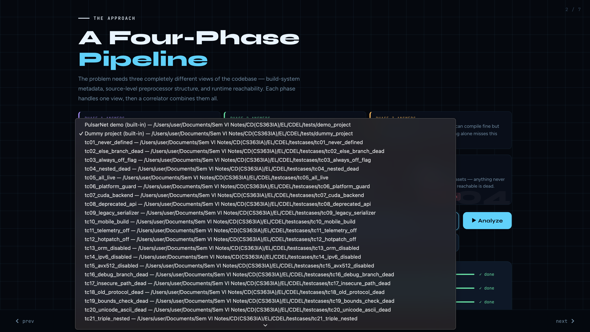 | 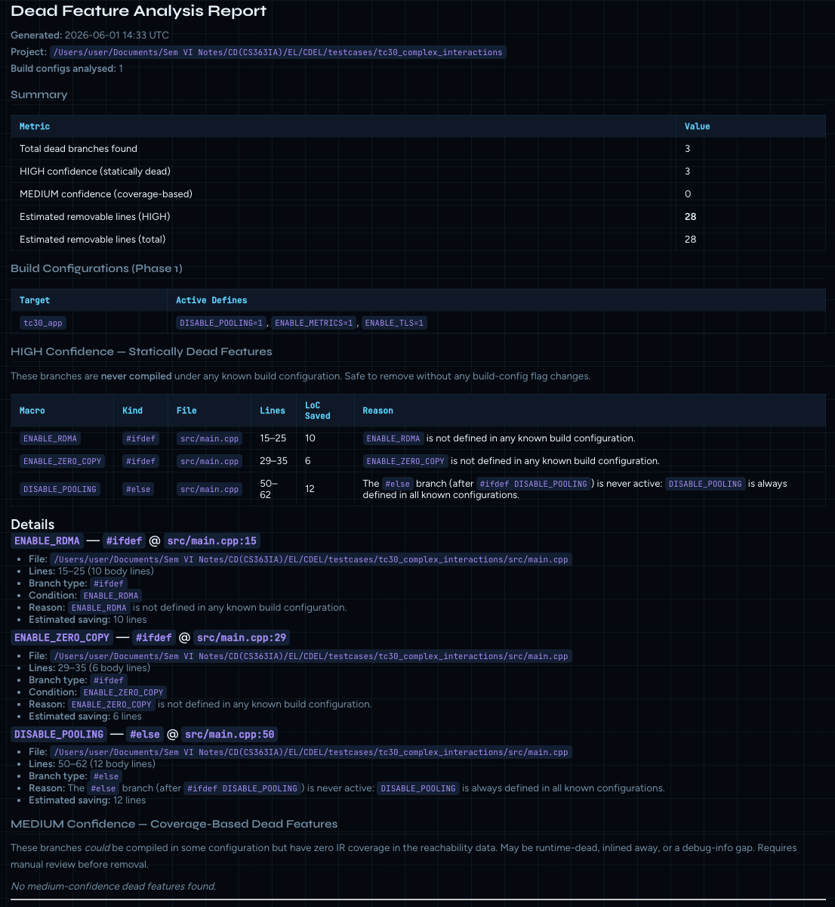 |

| Call graph (D3.js force layout) | Baseline comparison metrics |
|:---:|:---:|
| 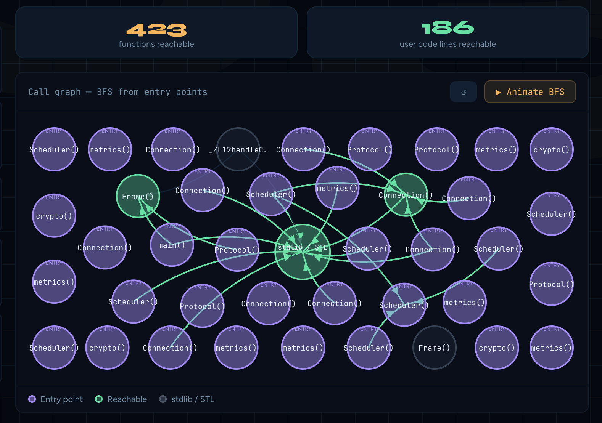 | 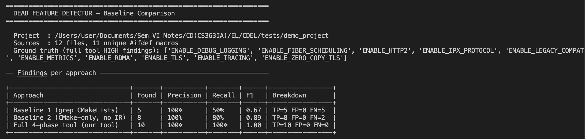 |

### Failure / limitation cases (honest evaluation)

| TC_FP01 — False positive (`configure_file` macro missed) | TC_FN02 — False negative (value-blind `#if LOG_LEVEL > 0`) |
|:---:|:---:|
| 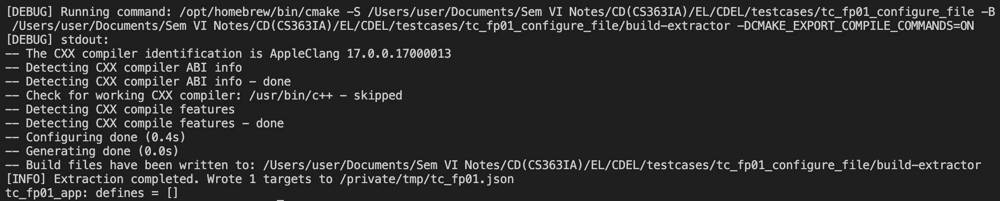 | 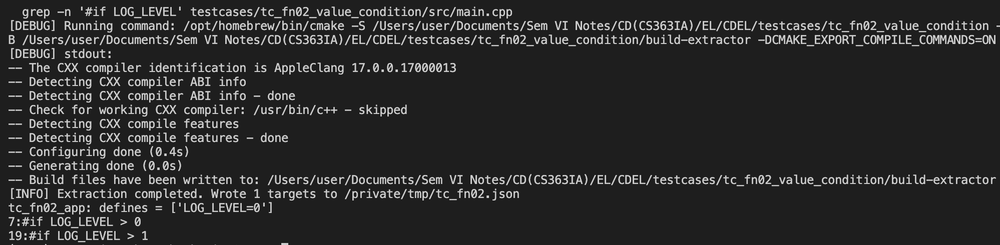 |

> Step-by-step commands to reproduce each failure: [`testcases/FAILURE_CASES.md`](testcases/FAILURE_CASES.md)

---

## Documentation

| Document | Contents |
|----------|----------|
| [DESIGN.md](DESIGN.md) | Problem framing, approach rationale, alternatives compared |
| [IMPLEMENTATION.md](IMPLEMENTATION.md) | LLVM/Clang plugin internals, BFS pass, correlator logic |
| [EVALUATION.md](EVALUATION.md) | Metrics, 3-way baseline comparison, 30 annotated test cases |

---

## Pipeline Overview


---

## Quickstart

```bash
# Step 1 — Build LLVM plugins (requires Homebrew LLVM)
bash build.sh

# Step 2 — Run full pipeline + open interactive web UI
bash run.sh                                  # demo project (PulsarNet)
bash run.sh /path/to/cmake/project           # custom project
bash run.sh /path/to/project /tmp/out 8080   # custom output dir + port

# Pipeline only (no browser)
NO_UI=1 bash run.sh /path/to/project

# Custom LLVM installation
LLVM_CONFIG=/opt/homebrew/opt/llvm/bin/llvm-config bash run.sh
```

| Project selector | Phase 4 — dead feature report |
|:---:|:---:|
|  |  |


---

## Design

> Full rationale, alternatives, and decision table: **[DESIGN.md](DESIGN.md)**

The fundamental challenge is that neither the source AST nor compiled IR alone is sufficient:

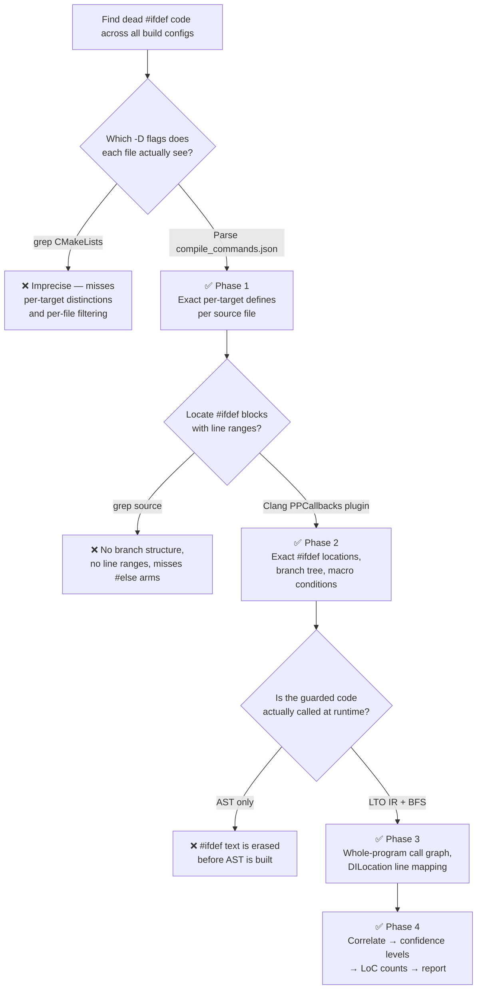

### Confidence classification

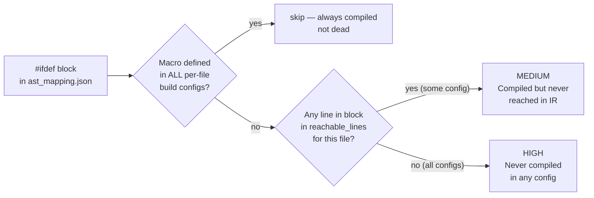

### Why not simpler alternatives?

| Approach | Miss rate | False-positive rate | LoC counts |
|----------|-----------|--------------------|-----------:|
| grep CMakeLists.txt | High (per-target blindness) | Medium (2/7 on PulsarNet) | ✗ |
| Phase 1 only (CMake-only) | Low | None | ✗ |
| clang-tidy unused-macros | Very high (`#ifdef` invisible to it) | Unknown | ✗ |
| cppcheck | High (no build-config awareness) | Medium | ✗ |
| **Our 4-phase tool** | **None (on tested cases)** | **None** | **✅** |

---

## Implementation

> Full LLVM/Clang internals: **[IMPLEMENTATION.md](IMPLEMENTATION.md)**

### Phase 2 — PPCallbacks stack machine

The preprocessor plugin tracks open `#ifdef` blocks using a stack. System-header blocks push a sentinel to keep the stack aligned without emitting output.

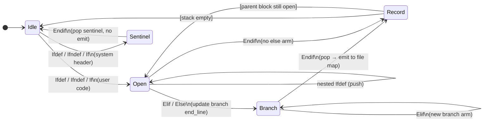

### Phase 3 — BFS reachability pass

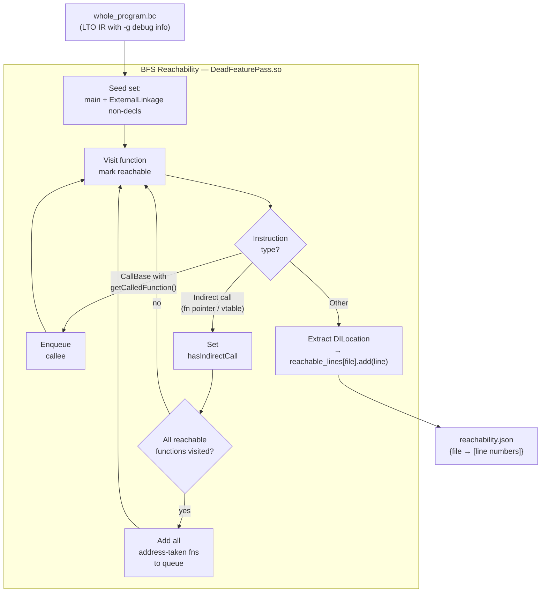

### Phase 4 — Per-file config filtering (critical detail)

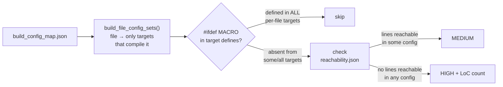

> **Why per-file matters:** a target that doesn't define `ENABLE_RDMA` but *also* doesn't compile `rdma.cpp` must not mask a HIGH finding in that file. Using all targets globally would introduce false negatives.

---

## Evaluation

> Full metrics, 3-way baseline comparison, 30 annotated test cases: **[EVALUATION.md](EVALUATION.md)**

### Baseline comparison

Three approaches compared on the PulsarNet demo project (7 known dead blocks):

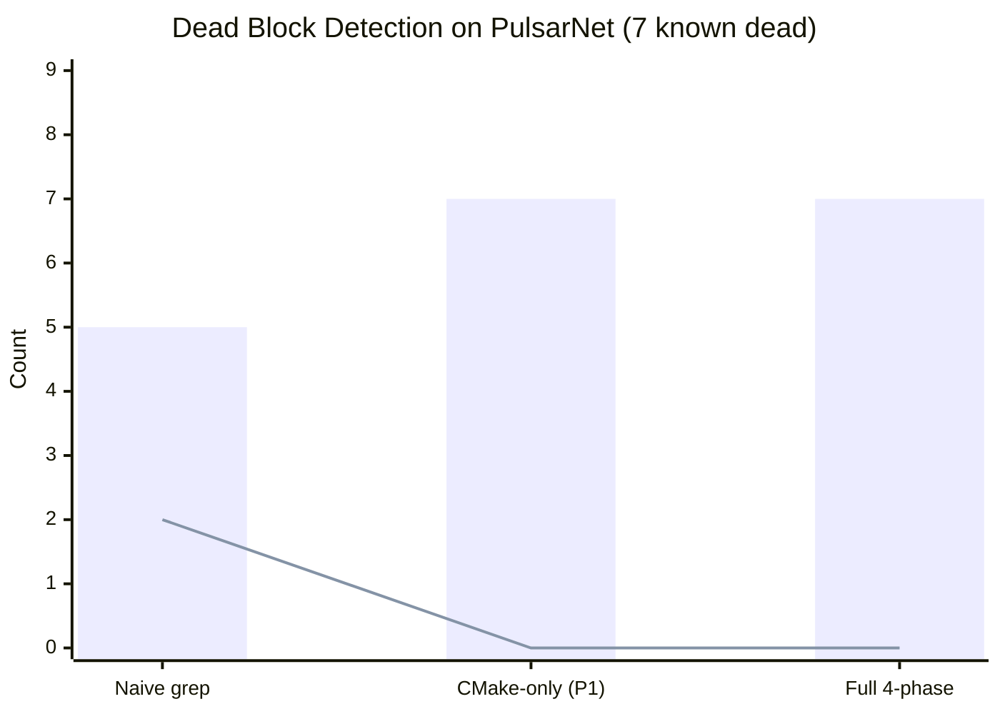

> Blue bars = true positives found. Orange line = false positives.

Run the baseline comparison yourself:

```bash
# Run full pipeline first
NO_UI=1 bash run.sh tests/demo_project

# Then compare all three approaches
python3 baseline/baseline_compare.py \
    --project    tests/demo_project \
    --tool-out   tests/artifacts/pipeline-out/dead_features.json \
    --config-map tests/artifacts/pipeline-out/build_config_map.json \
    --verbose
```

### Test cases (30 total)

| ID | Scenario | Pattern | Expected |
|----|----------|---------|----------|
| TC01 | `tc01_never_defined` | Prototype macro, zero cmake refs | 1 HIGH |
| TC02 | `tc02_else_branch_dead` | `#else` of always-ON macro | 1 HIGH |
| TC03 | `tc03_always_off_flag` | cmake option never wired to target | 1 HIGH |
| TC04 | `tc04_nested_dead` | Outer dead → nested blocks also dead | 3 HIGH |
| TC05 | `tc05_all_live` | All macros defined — control test | **0** |
| TC06 | `tc06_platform_guard` | WINDOWS_PLATFORM on Unix project | 1 HIGH |
| TC07 | `tc07_cuda_backend` | ENABLE_CUDA, no GPU hardware | 1 HIGH |
| TC08 | `tc08_deprecated_api` | DEPRECATED_V1_API, V1 removed | 1 HIGH |
| TC09 | `tc09_legacy_serializer` | LEGACY_BINARY_FORMAT replaced by JSON | 1 HIGH |
| TC10 | `tc10_mobile_build` | MOBILE_BUILD on desktop project | 1 HIGH |
| TC11 | `tc11_telemetry_off` | ENABLE_TELEMETRY option OFF, not wired | 1 HIGH |
| TC12 | `tc12_hotpatch_off` | ENABLE_HOT_PATCH option OFF | 1 HIGH |
| TC13 | `tc13_orm_disabled` | ENABLE_ORM option OFF | 1 HIGH |
| TC14 | `tc14_ipv6_disabled` | ENABLE_IPV6 option OFF | 1 HIGH |
| TC15 | `tc15_avx512_disabled` | ENABLE_AVX512 option OFF | 1 HIGH |
| TC16 | `tc16_debug_branch_dead` | RELEASE_BUILD always ON → debug `#else` dead | 1 HIGH |
| TC17 | `tc17_insecure_path_dead` | SECURITY_HARDENED always ON → insecure `#else` | 1 HIGH |
| TC18 | `tc18_old_protocol_dead` | PROTOCOL_V2 always ON → v1 `#else` dead | 1 HIGH |
| TC19 | `tc19_bounds_check_dead` | BOUNDS_CHECKING always ON → fast `#else` dead | 1 HIGH |
| TC20 | `tc20_unicode_ascii_dead` | UNICODE_SUPPORT always ON → ASCII `#else` dead | 1 HIGH |
| TC21 | `tc21_triple_nested` | EXPERIMENTAL → GPU → TENSOR (3-level) | 3 HIGH |
| TC22 | `tc22_offline_nested` | OFFLINE\_MODE → CACHE → COMPRESS (3-level) | 3 HIGH |
| TC23 | `tc23_elif_chain` | `#elif` arms with undefined macros | 2 HIGH |
| TC24 | `tc24_large_positive` | 8 macros all defined — large control test | **0** |
| TC25 | `tc25_mixed_live_dead` | Same file: 2 live + 2 dead blocks | 2 HIGH |
| TC26 | `tc26_multi_target_partial` | Shared file, SERVER_PUSH only in server target | 1 HIGH |
| TC27 | `tc27_ifndef_pattern` | `#ifndef ALWAYS_DEFINED` → block dead | 1 HIGH |
| TC28 | `tc28_vendor_extension` | VENDOR_ACME_SDK replaced by OSS | 1 HIGH |
| TC29 | `tc29_regression_guard` | REGRESSION_TESTS + INTERNAL_TESTING both dead | 2 HIGH |
| TC30 | `tc30_complex_interactions` | TLS+METRICS live, RDMA+ZERO_COPY dead, pool `#else` dead | 3 HIGH |

Run any test case:

```bash
bash run.sh testcases/tc04_nested_dead
```

Run all test cases and compare against baseline:

```bash
for tc in testcases/tc*/; do
    echo "=== $tc ==="
    NO_UI=1 bash run.sh "$tc" /tmp/dfd-tc-out 2>&1 | tail -5
    python3 baseline/baseline_compare.py \
        --project "$tc" \
        --tool-out /tmp/dfd-tc-out/dead_features.json \
        --config-map /tmp/dfd-tc-out/build_config_map.json
done
```

---

## Prerequisites

| Tool | Required for | Install |
|------|-------------|---------|
| Python 3.8+ | All phases | System |
| Flask | Web UI | auto-installed by `run.sh` |
| CMake 3.16+ | Phase 1 | `brew install cmake` |
| Ninja | Phase 1 (optional) | `brew install ninja` |
| LLVM 17+ (Homebrew) | Phases 2–3 | `brew install llvm` |

> **Apple Clang** (Xcode CLT) does not ship LLVM dev headers. Phases 2 and 3 require Homebrew LLVM. After install: `/opt/homebrew/opt/llvm/bin/llvm-config`.

---

## Repository Layout

```
CDEL/
├── extractor/
│   └── extractor.py              # Phase 1: CMake define extractor
├── llvm-pass/
│   ├── IfdefMapper/              # Phase 2: Clang PPCallbacks plugin (C++17)
│   │   ├── IfdefMapper.cpp
│   │   ├── CMakeLists.txt
│   │   └── build.sh
│   └── DeadFeaturePass/          # Phase 3: LLVM new-PM Module pass (C++17)
│       ├── DeadFeaturePass.cpp
│       ├── CMakeLists.txt
│       └── build.sh
├── templates/
│   └── index.html                # 7-slide interactive web frontend (D3.js + marked.js)
├── tests/
│   ├── dummy_project/            # Minimal CMake project: 2 targets, EXPERIMENTAL + LEGACY
│   ├── demo_project/             # PulsarNet: 3 targets, 7 intentional dead blocks
│   ├── run_phase1_test.sh
│   ├── run_phase2_test.sh
│   ├── run_phase3_test.sh
│   └── run_phase4_test.sh
├── testcases/                    # 30 labelled test cases (see EVALUATION.md)
│   ├── tc01_never_defined/ … tc30_complex_interactions/
│   └── README.md
├── baseline/
│   └── baseline_compare.py       # Runnable 3-way baseline comparison script
├── correlator.py                 # Phase 4: 3-source join + Markdown/JSON report
├── pipeline.py                   # Orchestrator: DeadFeaturePipeline class
├── app.py                        # Flask web UI + REST API
├── build.sh                      # Build LLVM plugins (IfdefMapper + DeadFeaturePass)
├── run.sh                        # One-shot: pipeline → web UI
├── requirements.txt              # Flask
├── DESIGN.md                     # Approach rationale and alternatives
├── IMPLEMENTATION.md             # LLVM/Clang plugin internals
└── EVALUATION.md                 # Metrics, baseline comparison, 30 test cases
```

---

## Output Artifacts

All artifacts are gitignored and written to `output_dir` (default `tests/artifacts/pipeline-out/`).

| File | Produced by | Contents |
|------|------------|---------|
| `build_config_map.json` | Phase 1 | target → defines + files |
| `ast_mapping.json` | Phase 2 | `#ifdef` block → file, line range, macro |
| `reachability.json` | Phase 3 | reachable line numbers per file |
| `dead_features.json` | Phase 4 | dead blocks with confidence + LoC |
| `report.md` | Phase 4 | human-readable Markdown report |
| `ir/` | Phase 3 | per-TU `.bc` + `whole_program.bc` |
